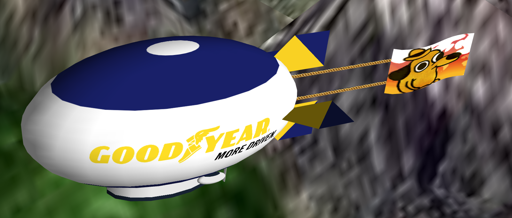
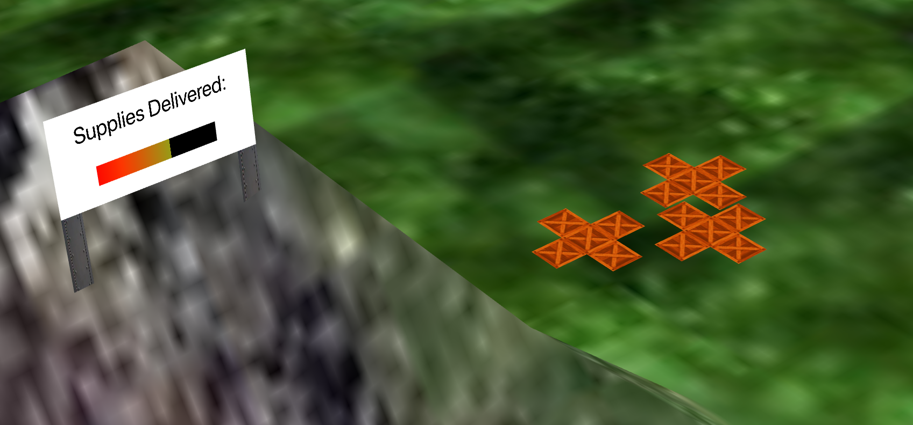
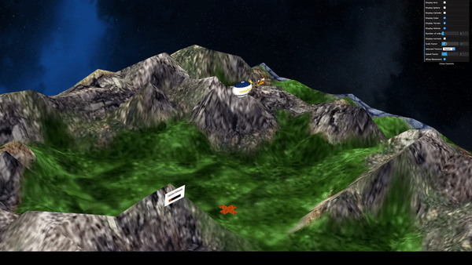

# CGRA Project

[Try it out](https://joaoasousa.github.io/CGRA_2Y2S)

- **Project name:** – Final project for CGRA
- **Short description:** Web game consisting of controlling an airship and dropping boxes 
- **Institution:** [FEUP](https://sigarra.up.pt/feup/en/web_page.Inicial)
- **Course:** [CGRA](https://sigarra.up.pt/feup/en/ucurr_geral.ficha_uc_view?pv_ocorrencia_id=436438) (Computer Graphics)
- **Project grade:** 19.1/20.0
- **Group members:**
    - [João António Cardoso Vieira e Basto de Sousa](https://github.com/JoaoASousa) ([up201806613@fe.up.pt](up201806613@fe.up.pt))
    - [Rafael Soares Ribeiro](https://github.com/up201806330) ([up201806330@fe.up.pt](up201806330@fe.up.pt))

## Media

## Controls

- **W**/**S** to move forwards/backwards
- **A**/**D** to turn left/right
- **P** activates auto-pilot
- **L** drops box
- **R** reset scene

## Extra Features

- The vertical flaps move smoothly with player input
- Boxes have an opening animation when hitting the ground